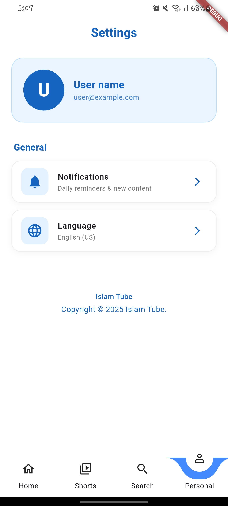

# IslamTube – Islamic Video Aggregator

## Overview
IslamTube is a mobile app that collects Islamic videos from YouTube using the YouTube Data API.  
It focuses only on trusted Islamic channels and shows clean feeds of shorts, lectures, tafsir, reminders, and recitations.

## Features
- Islamic video feed (shorts + full videos)
- Search across selected Islamic channels
- Swipe-based shorts mode
- Embedded YouTube player
- Clean, distraction-free UI

## Setup
- Add your YouTube API key
- Add your approved Islamic channel IDs
- Build and run the app (Android/iOS)

## Screenshots

|  |  |  |  |
|--------------------------------------|--------------------------------------|--------------------------------------|--------------------------------------|
