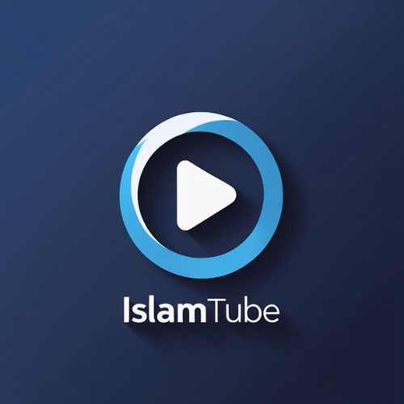
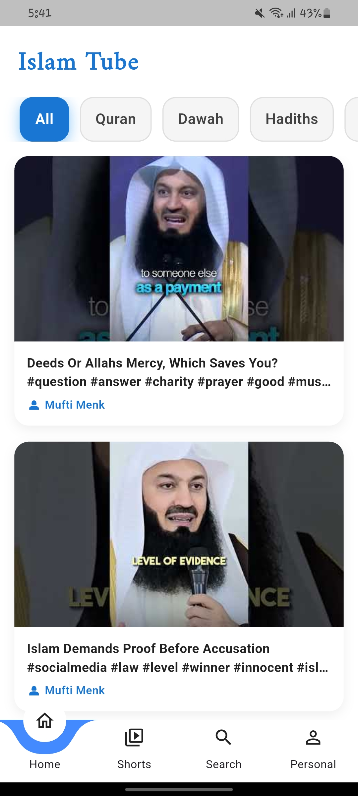
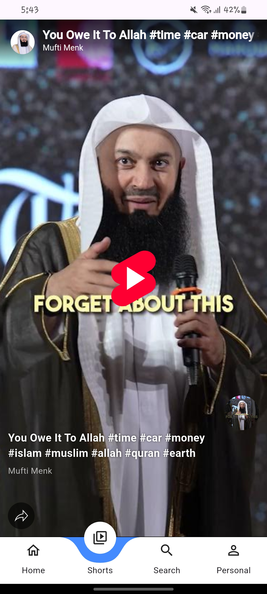
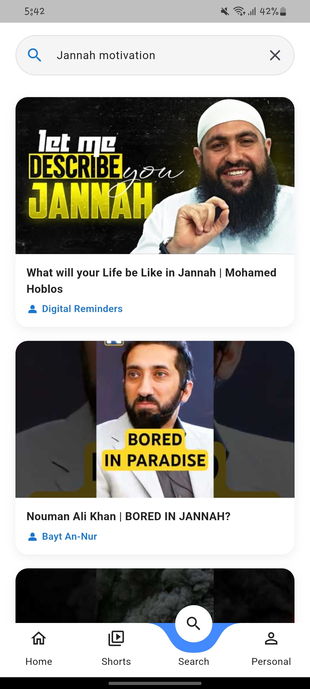
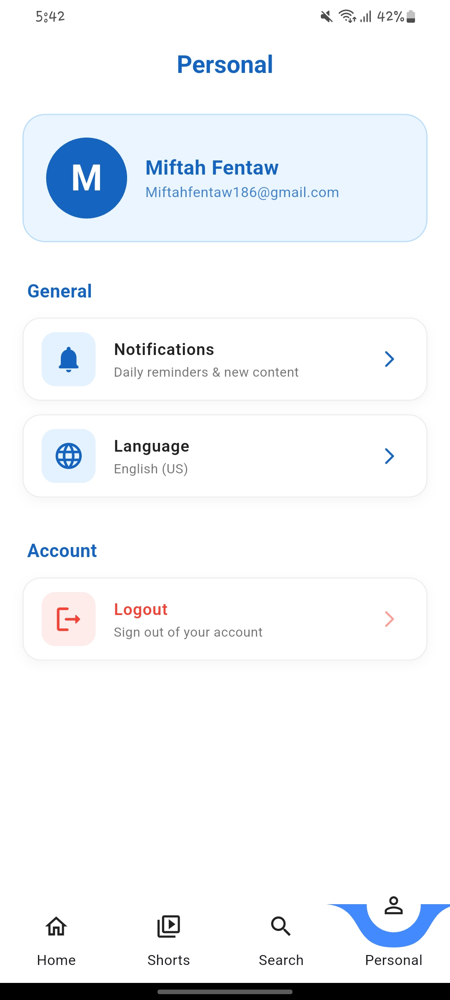
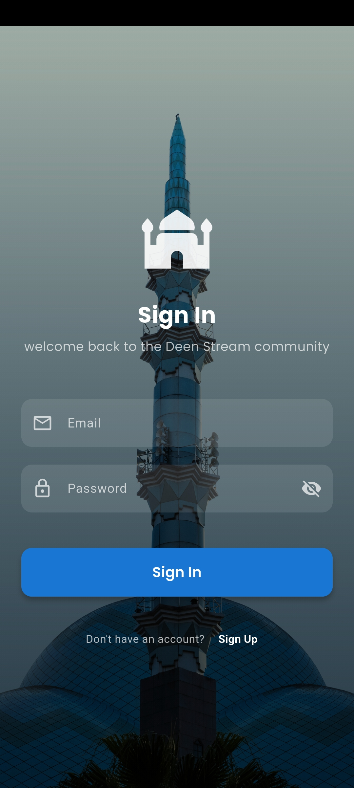
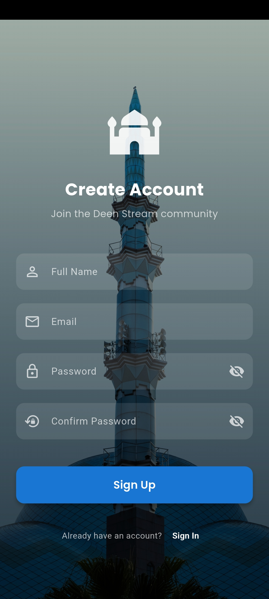

<div align="center">
  
  <h1>Islam Tube</h1>
  <p><strong>A Distraction-Free Islamic Video Aggregator</strong></p>
  <p>Streamlining authentic Islamic knowledge through a clean, modern, and focused mobile experience.</p>
</div>

<hr />

## 📱 App Showcase

| Home Screen | Shorts Feed | Search Experience |
|:---:|:---:|:---:|
|  |  |  |

| Personal Settings | signin | signup |
|:---:|:---:|
|  |  | 

<hr />

## ✨ Key Features
174253
- 🕋 **Curated Content**: Aggregates videos exclusively from trusted Islamic channels.
- 📺 **Seamless Playback**: High-quality video streaming using an integrated YouTube player.
- ⚡ **Islamic Shorts**: A dedicated swipe-based vertical feed for quick reminders and clips.
- 🔍 **Powerful Search**: Real-time search across hundreds of curated videos with trending suggestions.
- 👤 **User Profiles**: Personalized experience with secure local authentication.
- 🌙 **Modern UI**: Clean, minimal design tailored for focus and spiritual reflection.

<hr />

## 🛠️ Technical Highlights

### 🛡️ Intelligent Embeddability Filtering
One of the core technical challenges solved in this project is the **"Playback Disabled"** issue. The app now communicates with the YouTube API to verify if a video allows embedding *before* showing it to the user. This ensures a 100% playable feed.

### 🔐 Secure & Persistent Auth
Built with `shared_preferences`, the app features a local authentication system that keeps you logged in across sessions, providing a seamless "install and stay" experience.

### ⌨️ Optimized Keyboard Handling
Custom UX logic ensures that the keyboard never blocks your view. Screens automatically resize and support scrolling during data entry, and the keyboard intelligently dismisses when switching between features.

<hr />

## 💻 Tech Stack

- **Framework**: [Flutter](https://flutter.dev/) (Dart)
- **API**: [YouTube Data API v3](https://developers.google.com/youtube/v3)
- **UI Components**: 
  - `curved_labeled_navigation_bar`
  - `google_fonts` (Amiri & Poppins)
  - `youtube_player_flutter`
- **Storage**: `shared_preferences`
- **Architecture**: Clean UI-Service separation

<hr />

## 📁 Project Structure

```text
lib/
├── core/
│   ├── constants/    # App constants & channel sources
│   ├── models/       # Data models (User, Video)
│   └── services/     # API & Auth logic (YouTube, Persistence)
├── presentation/
│   ├── screens/      # Feature screens (Home, Shorts, Search, Personal)
│   └── widgets/      # Shared UI components
└── main.dart         # App entry & Routing logic
```

<hr />

## 🚀 Getting Started

1. **Clone the repository**
   ```bash
   git clone https://github.com/Miftah-Fentaw/Islam-Tube.git
   ```

2. **Setup API Keys**
   Create a file `lib/apikeys.dart` and add your YouTube API Key:
   ```dart
   const String videosapikey = 'YOUR_API_KEY';
   const String youtubeshortsapikey = 'YOUR_API_KEY';
   ```

3. **Install Dependencies**
   ```bash
   flutter pub get
   ```

4. **Run the App**
   ```bash
   flutter run
   ```

---
<p align="center">Made with ❤️ for the Ummah</p>
